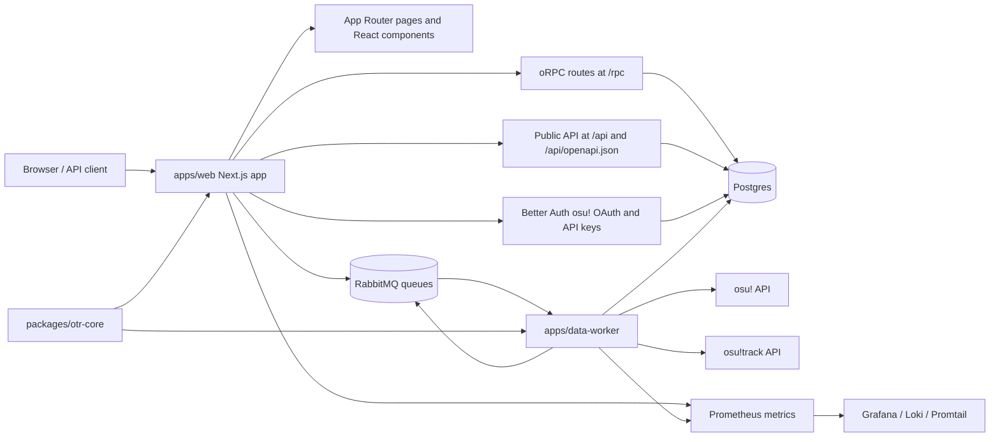

# Project Overview

o!TR Web is the Bun workspace for osu! Tournament Rating: a Next.js web app,
shared TypeScript core package, and background data worker for tournament ratings,
audit/admin workflows, public API access, osu! data fetching, and monitoring.

## Repository Structure

- `apps/` - Workspace applications.
  - `apps/web/` - Next.js App Router site, API routes, oRPC server, UI components,
    Drizzle migrations, and Playwright e2e tests.
  - `apps/data-worker/` - Bun worker that consumes RabbitMQ jobs for osu!, osu!track,
    automation checks, statistics, and player refetching.
- `packages/` - Shared workspace packages.
  - `packages/otr-core/` - Shared Drizzle schema, queue contracts, message types,
    logging helpers, osu! enums, and utilities.
- `lib/` - Root-level helpers used outside app packages, currently root env loading.
- `monitoring/` - Prometheus, Loki, Promtail, and Grafana config for staging and prod.
- `scripts/` - Local, migration, and e2e database helper scripts.
- `.github/` - CODEOWNERS, release metadata, and GitHub Actions workflows.
- `.husky/` - Git hooks; the pre-commit hook runs linting and type checking.
- Root config files - Bun workspaces, TypeScript, Drizzle, Docker Compose, Prettier,
  environment examples, lockfile, license, and README.

## Build & Development Commands

Install dependencies:

```sh
bun install
```

Install dependencies exactly as CI does:

```sh
bun install --frozen-lockfile
```

Run the web app in development (default — the data-worker is not started):

```sh
bun run dev
```

Run both apps (web + data-worker) in development:

```sh
bun run dev:all
```

Run individual development servers:

```sh
bun run --filter web dev
bun run --filter web dev:turbo
bun run dev:worker
```

Build all apps:

```sh
bun run build
```

Build individual apps:

```sh
bun run --filter web build
bun run --filter data-worker build
```

Start production entry points:

```sh
bun run start
bun run --filter web start
bun run --filter data-worker start
```

Run linting:

```sh
bun run lint
```

Run type checking:

```sh
bunx tsc --noEmit
```

Run formatting:

```sh
bun run format
bunx prettier . --check
```

Run tests:

```sh
bun test
bun run --filter data-worker test
```

Run web e2e tests from `apps/web`:

```sh
cd apps/web
bun run test:e2e
```

Debug or inspect e2e tests from `apps/web`:

```sh
cd apps/web
bun run test:e2e:ui
bun run test:e2e:headed
```

Run database migrations:

```sh
bunx drizzle-kit migrate
./scripts/run-migrations.sh
```

(CI only) set up an e2e database dump when `GCS_BUCKET` and Google Cloud auth are configured:

```sh
./scripts/e2e-db-setup.sh
```

Build local Docker images and start the compose stack:

```sh
./scripts/local-up.sh
```

Start the compose stack directly:

```sh
docker compose up
```

Deployments are driven by `.github/workflows/deploy-trigger.yml` and
`.github/workflows/deploy.yml`. The remote host deployment sequence is:

```sh
docker compose pull
docker compose --profile migrate run --rm migrate
docker compose up -d --remove-orphans
```

## Code Style & Conventions

- Use TypeScript with `strict: true`; the root `tsconfig.json` includes web, worker,
  and package sources.
- Use shadcn-ui as a base for all UI components.
- Use Bun commands and Bun workspaces; keep `bun.lock` consistent with dependency
  changes.
- Use `@/*` for `apps/web/*` imports and `@otr/core` or `@otr/core/*` for shared code.
- Format with Prettier: single quotes, trailing commas where valid in ES5, and the
  Tailwind Prettier plugin.
- Tailwind class sorting is configured with `./apps/web/app/globals.css` and the
  `clsx`, `cva`, and `cn` helper names.
- Web linting uses `eslint-config-next/core-web-vitals` and
  `eslint-config-next/typescript`; keep the existing React Hooks rule overrides.
- Worker linting uses ESLint recommended plus `@typescript-eslint/recommended`; unused
  parameters, variables, and caught errors may be prefixed with `_`.
- Name React components in PascalCase, hooks with `use*`, tests as `*.test.ts` or
  under `__tests__`, and Playwright specs as `*.e2e.ts`.
- Keep oRPC procedure modules near `apps/web/app/server/oRPC/procedures` and update
  `apps/web/app/server/oRPC/router.ts` when adding routes.
- Keep shared schema, queues, messages, logging, and osu! enums in `packages/otr-core`
  when both web and worker need them.
- The Husky pre-commit hook runs `bun run lint`, `bunx tsc`, and then `git add .`.

## Architecture Notes



`apps/web` owns the user-facing Next.js App Router pages, authenticated oRPC routes,
public OpenAPI routes, Better Auth integration, admin tools, and queue publication.
Public API requests require an API key through `Authorization: Bearer <key>` or
`x-api-key`; website RPC requests use the oRPC router and session context.

`packages/otr-core` is the shared contract layer. It exports the Drizzle schema and
relations, queue names, message envelopes, queue publisher interfaces, logging types,
osu! enums, and shared utilities. Database migrations are emitted to
`apps/web/drizzle` from the schema in `packages/otr-core/src/db/schema.ts`.

`apps/data-worker` starts a metrics server, creates osu! and osu!track API clients,
applies fixed-window rate limits, consumes RabbitMQ queues with prefetch `1`, and
writes fetched or computed data back to Postgres. Worker services handle beatmaps,
matches, players, osu!track history, automation checks, tournament statistics, and
scheduled player refetching.

Docker Compose runs Postgres, RabbitMQ, web, data-worker, a migration profile, and the
monitoring stack. Staging uses `docker-compose-staging.yml` with staging image tags and
different host ports.

## Testing Strategy

- Unit and service tests use `bun test`; CI runs this from the repository root.
- Worker tests live under `apps/data-worker/src/**/__tests__` and worker integration
  tests live under `apps/data-worker/tests/integration`.
- Web server procedure tests live under
  `apps/web/app/server/oRPC/procedures/**/__tests__`.
- E2E tests use Playwright in `apps/web/e2e` with `testMatch: **/*.e2e.ts`.
- Playwright starts the web app on `http://localhost:3001` with
  `E2E_TEST_AUTH=true`; CI retries twice and uses one worker.
- Manual e2e CI is `.github/workflows/e2e-tests.yml`; it restores a production-replica
  database via `otr-scripts`, runs Drizzle migrations, installs Chromium, and runs
  `bun run test:e2e` from `apps/web`.
- Main CI is `.github/workflows/ci.yml`; it installs with `bun install
--frozen-lockfile`, then runs `bun test`, `bun run lint`, `bunx tsc --noEmit`,
  `bunx prettier . --check`, `bun run build`, and the worker binary build.

Run the local CI-equivalent checks before broad changes:

```sh
bun test
bun run lint
bunx tsc --noEmit
bunx prettier . --check
bun run build
```

Run Playwright locally after UI, auth, routing, or API behavior changes:

```sh
cd apps/web
bun run test:e2e
```

## Security & Compliance

- Do not commit `.env` or `.env.*`; only `.env.example` is intended to be committed.
- Local `.env` values include database URLs, RabbitMQ URLs, Better Auth secrets, osu!
  OAuth clients, rate limits, refetch flags, metrics auth, and Grafana credentials.
- Docker-specific env vars use the `DOCKER_` prefix and are consumed by Docker Compose.
- GitHub deployment secrets include Docker Hub, Tailscale, SSH, remote `.env`, and GCS
  service-account data; keep them in GitHub Secrets, not in files.
- Better Auth uses osu! OAuth, admin roles, API keys, and a test-only auth plugin gated
  by `E2E_TEST_AUTH`.
- Better Auth API keys are configured with a rate limit of 60 requests per 60 seconds.
- The public `/api` route requires an API key except for `OPTIONS`; `/api/metrics`
  requires `Authorization: Bearer $METRICS_AUTH_TOKEN` when that env var is set.
- Data-worker osu! and osu!track request rates are controlled by
  `OSU_API_RATE_LIMIT_*` and `OSUTRACK_API_RATE_LIMIT_*`.
- Queue messages are persisted to durable RabbitMQ queues with priority metadata.
- The project license is GNU AGPL-3.0 as documented in `LICENSE`.

## Agent Guardrails

- Never edit committed secrets or local secret files: `.env`, `.env.*`, `*.pem`, or
  generated credentials.
- Never modify generated or dependency output unless explicitly asked:
  `node_modules/`, `.next/`, `dist/`, `build/`, `coverage/`, `playwright-report/`,
  `test-results/`, `.playwright-mcp/`, `*.tsbuildinfo`, and top-level `*.png`.
- Treat `apps/web/drizzle/**` migrations as database history. Schema changes should
  start in `packages/otr-core/src/db/schema.ts`, then generate or update migrations
  intentionally.
- Changes to auth, admin permissions, API keys, audit logs, queue contracts, database
  cascades, migrations, deployment workflows, Dockerfiles, or monitoring config need
  human review.
- Preserve workflow and Docker behavior unless the task explicitly targets them.
- Do not add dependencies without updating `bun.lock` and checking that workspace
  scripts still run.
- Keep queue consumer concurrency conservative unless the rate-limit and data-integrity
  impact is reviewed; current consumers use prefetch `1`.
- Preserve API-key and external osu!/osu!track rate limits when changing request flow.
- Prefer focused edits in the owning package over cross-workspace refactors.

## Extensibility Hooks

- Add new web pages under `apps/web/app` and reusable UI under `apps/web/components`.
- Add server procedures under `apps/web/app/server/oRPC/procedures`, register them in
  `router.ts`, and define request/response schemas under `apps/web/lib/orpc/schema`.
- Expose public API endpoints by tagging oRPC contracts as `public`; the OpenAPI handler
  filters to public procedures and publishes `/api/openapi.json`.
- Add shared database, queue, message, logging, osu!, or utility contracts in
  `packages/otr-core` when both apps need them.
- Add queue names in `packages/otr-core/src/queues/constants.ts` and message payloads in
  `packages/otr-core/src/messages/types.ts`, then wire publishers and consumers.
- Add worker capabilities as services/workers in `apps/data-worker/src` and start them
  from `apps/data-worker/src/index.ts`.
- Add database tables or relations in `packages/otr-core/src/db`, then emit migrations
  to `apps/web/drizzle` with Drizzle.
- Add metrics through the web or worker metrics registries and update monitoring
  dashboards or alert rules when production visibility changes.
- Feature/env flags currently include `NEXT_PUBLIC_IS_STAGING`, `E2E_TEST_AUTH`,
  `PLAYER_OSU_AUTO_REFETCH_ENABLED`, and `PLAYER_OSUTRACK_AUTO_REFETCH_ENABLED`.
- Required env vars are documented in `.env.example`; keep that file current when
  adding new configuration.

## Further Reading

- [README.md](README.md)
- [.env.example](.env.example)
- [package.json](package.json)
- [apps/web/package.json](apps/web/package.json)
- [apps/data-worker/package.json](apps/data-worker/package.json)
- [packages/otr-core/package.json](packages/otr-core/package.json)
- [drizzle.config.ts](drizzle.config.ts)
- [apps/web/playwright.config.ts](apps/web/playwright.config.ts)
- [.github/workflows/ci.yml](.github/workflows/ci.yml)
- [.github/workflows/e2e-tests.yml](.github/workflows/e2e-tests.yml)
- [.github/workflows/deploy-trigger.yml](.github/workflows/deploy-trigger.yml)
- [.github/workflows/deploy.yml](.github/workflows/deploy.yml)
- [docker-compose.yml](docker-compose.yml)
- [docker-compose-staging.yml](docker-compose-staging.yml)
- [LICENSE](LICENSE)
